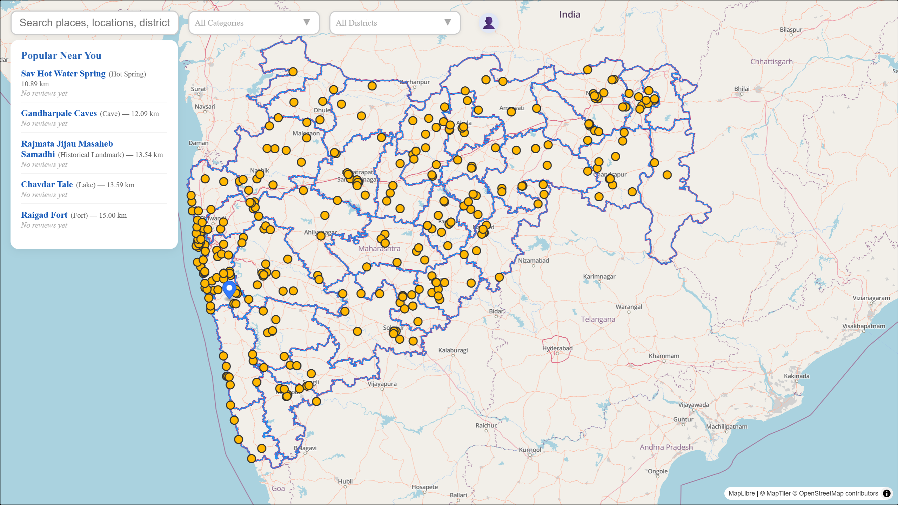
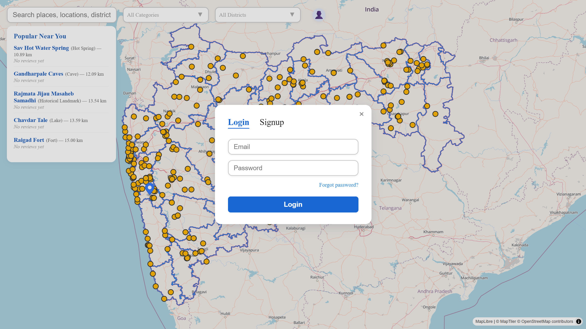
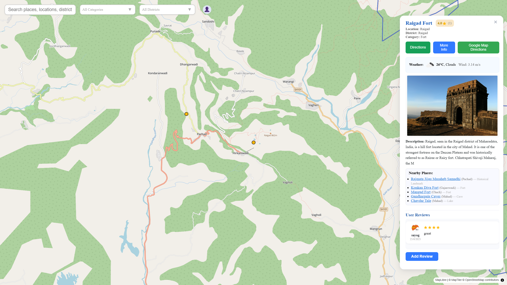
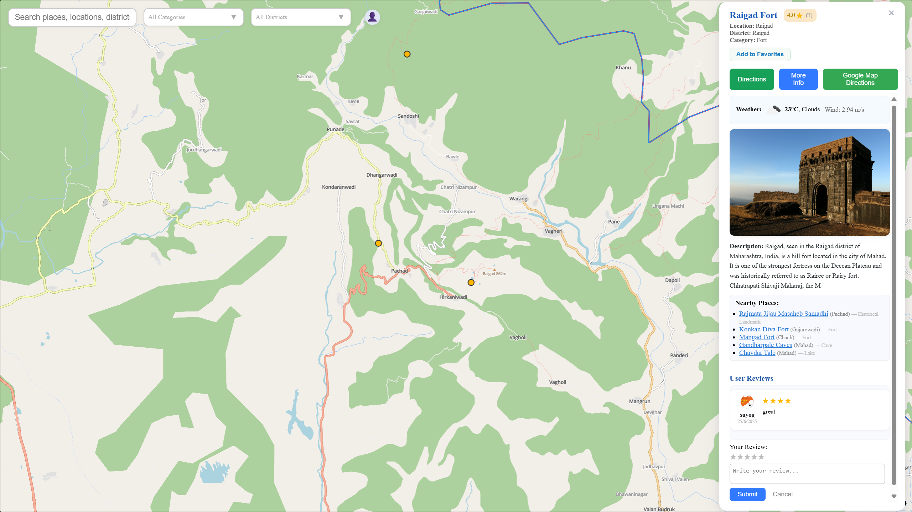
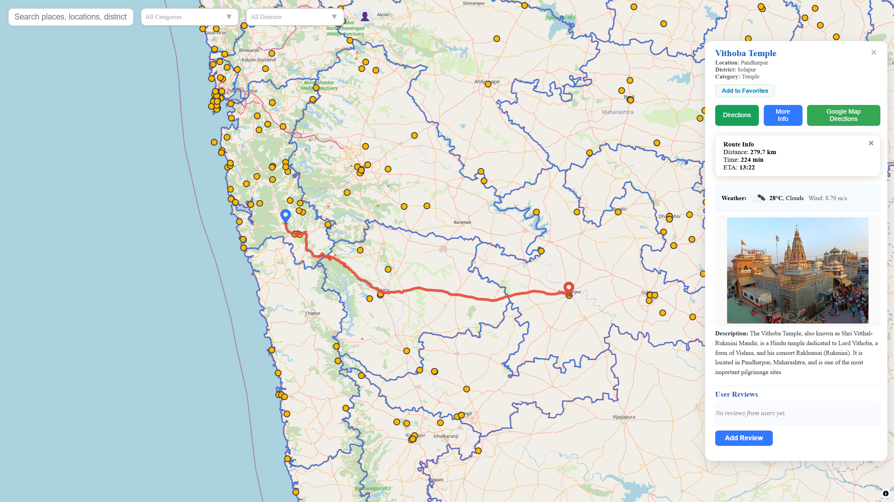

# 🏛️ Heritage Places Map & Recommendation Engine

**Interactive GIS-powered platform to explore Maharashtra’s cultural and heritage sites with smart recommendations, reviews, and real-time navigation.**

---

## 🌍 Overview

This web application enables users to explore Maharashtra’s cultural heritage using a modern interactive map system.  
Features include site discovery, location-based recommendations, reviews, route planning, and personalized user experience.

---

## 🚀 Features

- 🗺️ **Interactive Map Visualization** using MapLibre GL  
- 📍 **Smart recommendations** based on distance, ratings & filters  
- 🔐 **Firebase authentication** (Login, Signup, Password Reset)  
- ⭐ **Review & Rating system** with favorites  
- 🧭 **Route planning** using OpenRouteService  
- 💾 **Dynamic GeoJSON layers** processed via QGIS  
- 📱 **Fully responsive UI**

---

## 📷 UI Preview

### 🏠 Interactive Map Interface  
Users can explore heritage sites, search, and apply category/district filters.

---

### 🔑 Authentication (Login / Signup)

---

### 🏛️ Place Details & Reviews

---

### ⭐ Posting Reviews

---

### 🧭 Route Planning & Navigation

---

## 🧠 Tech Stack

| Layer | Technology |
|-------|------------|
| Frontend | React + MapLibre GL JS |
| Backend | Node.js |
| Authentication | Firebase Auth |
| Spatial Data | QGIS, GeoJSON |
| External APIs | OpenRouteService, OpenWeatherMap |

---

## 🧭 System Workflow (Summary)

1. User opens the web map (React + MapLibre renders datasets)
2. GeoJSON layers load dynamically (district borders, site markers)
3. Filters/search update live with UI state
4. Reviews, favorites & authentication managed via Firebase
5. Route planning uses OpenRouteService API
6. Updates sync in real-time across users

